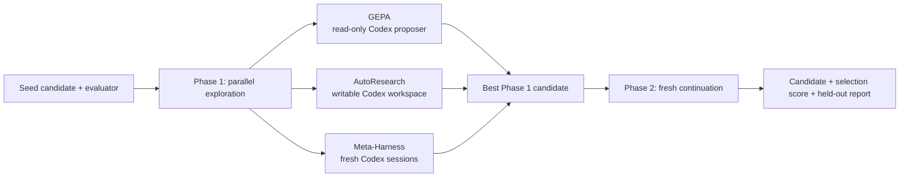

# GEPA Omni

GEPA Omni is a Codex plugin for improving scorable text artifacts—prompts,
programs, configurations, schemas, SQL, regular expressions, plans, and agent
instructions—with evaluator-driven search from [GEPA](https://github.com/gepa-ai/gepa).

The plugin combines three exploratory engines with a fresh continuation run:
GEPA reflection, AutoResearch, and Meta-Harness. It also exposes each engine
individually for comparison and debugging.

> The repository slug is `fleet-gepa-omni`, while the installable plugin ID is
> `gepa-omni` and the shipped skill ID is `gepa-omni-skill`. This distinction is
> intentional: the former identifies the GitHub repository; the latter two are
> the package and skill identities consumed by Codex.

## How the workflow works

The default workflow shares one seed, evaluator, objective, and selection data
across three Phase 1 branches. It selects the highest-scoring candidate, then
starts a new Phase 2 optimizer with that candidate. The default continuation is
fresh GEPA; AutoResearch and Meta-Harness continuations are explicit options.



Important boundaries:

- `test_set` is withheld from all Phase 1 branches and is scored only by the
  final Phase 2 run.
- Omni requires an explicit `max_evals` and/or `max_token_cost`. An
  evaluation-only run needs at least four evaluations so all four phases get a
  positive slice; use a standalone engine for smaller budgets.
- `omni` is a preflight target and the plugin's default orchestration mode. It
  is not a value to pass as `OptimizeAnythingConfig(engine=...)`.
- The public `optimize_anything` API is string-candidate-first. The local
  Codex/Pi proposer adapters use named component mappings only at their
  lower-level proposer boundary.

## Use from Codex

Invoke the shipped skill with a request that names the artifact and evaluator:

```text
Use $gepa-omni-skill to improve this prompt against my evaluator. Preserve the
output format and report the held-out score separately.
```

Useful requests include:

- “Optimize this candidate against my evaluator with Omni.”
- “Help me write a feedback-rich GEPA evaluator.”
- “Compare GEPA, AutoResearch, and Meta-Harness.”

The skill is implicitly invocable, but explicitly naming
`$gepa-omni-skill` makes the intended workflow clear.

## Evaluator and data contract

The evaluator should return a higher-is-better score plus actionable feedback:

```python
def evaluate(candidate: str, example) -> tuple[float, dict]:
    output = run_system(candidate, example)
    score = grade(output, example)
    return score, {"output": output, "expected": example["gold"]}
```

Use the data arguments as follows:

| Input | Role |
| --- | --- |
| `dataset` | Examples used for multi-task optimization. |
| `valset` | Selection/generalization examples; keep it representative. |
| `test_set` | Sealed, reporting-only examples for the final score. |

Return failures, diffs, outputs, and partial-credit details in `info`; a bare
float gives the proposer little direction. For stochastic systems, average
multiple samples inside the evaluator and include the sample diagnostics.

See the [API reference](skills/gepa-omni-skill/references/api.md) and
[evaluator guide](skills/gepa-omni-skill/references/writing_evaluators.md) for
the complete launcher contract.

## Engine choices

| Engine | Behavior | Default local runtime |
| --- | --- | --- |
| `gepa` | Reflective evolutionary search using evaluator feedback. | Read-only `CodexAgentProposer`. |
| `autoresearch` | Long-horizon experiment loop with Ralph-style continuation. | Writable Codex runner; Pi/Claude are explicit alternatives. |
| `meta_harness` | Proposes candidates while the framework evaluates and selects them. | Fresh ephemeral Codex session per iteration; Pi/Claude are explicit alternatives. |
| `best_of_n` | Independent candidate sampling baseline. | No feedback or search history. |

For a standalone run, pass one of the four engine names above and give it the
full budget. For the normal portfolio workflow, omit the engine override and
use the local `skills/gepa-omni-skill/scripts/omni_pipeline.py` helper.

## Requirements

- Python 3.10 or newer.
- [`uv`](https://docs.astral.sh/uv/) for repository development.
- An engine-capable `gepa[full]` environment supplied by the consumer. GEPA is
  intentionally not vendored or declared as a root dependency.
- An authenticated `codex` CLI for the default backend. Select an authenticated
  Pi or Claude CLI explicitly when needed.
- For Codex runs with `max_token_cost`, both input and output USD-per-million
  token rates.
- For sandboxed Pi runs, the OS sandbox prerequisites described in
  [`references/pi.md`](skills/gepa-omni-skill/references/pi.md).

Supply the maintained engine fork explicitly when required by the consumer
environment:

```bash
export GEPA_OMNI_SPEC='gepa[full] @ git+https://<maintained-gepa-fork>/<org>/<repo>.git@<commit>'
uv run --project . --with "$GEPA_OMNI_SPEC" \
  python3 skills/gepa-omni-skill/scripts/preflight.py \
  --engine omni --agent-backend codex \
  --max-token-cost 5 \
  --codex-input-cost-per-million 2 \
  --codex-output-cost-per-million 8
```

## Preflight and diagnostics

Run the extended preflight before a live optimization. It checks the launcher,
engine registry, proposer/runner surface, credentials, and relevant sandbox
prerequisites. It does not make model calls unless `--test-lm` is supplied.

```bash
python3 skills/gepa-omni-skill/scripts/preflight.py --engine gepa
python3 skills/gepa-omni-skill/scripts/preflight.py --engine omni
python3 skills/gepa-omni-skill/scripts/preflight.py \
  --engine omni --agent-backend pi
```

The read-only GEPA proposer stores each proposal's inputs, schema, response,
usage, standard output/error, and validation errors. Writable agent engines use
an external workspace and retain their command, session, JSONL output, usage,
completion state, and cost estimate. Configure `run_dir` and `output_dir`
outside this checkout so agent workspaces and diagnostics cannot modify the
plugin source.

Codex proposal processes use `--sandbox read-only`. Codex-backed AutoResearch
and Meta-Harness use `--sandbox workspace-write` in their external workspaces;
this is not unrestricted host access, and `sandbox=False` is rejected. Pi has
no silent unsandboxed fallback.

## Repository layout

| Path | Purpose |
| --- | --- |
| `.codex-plugin/plugin.json` | Installable manifest and marketplace metadata. |
| `skills/gepa-omni-skill/SKILL.md` | The shipped Codex skill and default workflow. |
| `skills/gepa-omni-skill/references/` | API, Omni, evaluator, backend, tracking, and gotcha guides. |
| `skills/gepa-omni-skill/scripts/` | Codex/Pi proposers, Omni composition, preflight, and self-evaluation entrypoints. |
| `tests/` and `tools/test_*.py` | Deterministic contract, proposer, pipeline, preflight, staging, and harness tests. |
| `tools/` | Development-only staging and bounded self-evaluation helpers; not shipped. |
| `LICENSE` | MIT license text; included in the runtime payload. |

## Development and packaging

Install the development dependencies and run the local checks:

```bash
uv sync --project . --group dev
uv run pytest -q
uv run ruff check . --select C901
git diff --check
```

The development checkout contains tests and tooling that are not part of the
installed plugin. Stage only the runtime payload into an empty external
directory whose final name is `gepa-omni`:

```bash
stage_parent="$(mktemp -d)"
python3 tools/stage_plugin.py --output "$stage_parent/gepa-omni"
```

The staged payload must contain only `.codex-plugin/`, `skills/`, and `LICENSE`.
Publish or install that staged payload through the configured Codex marketplace
using the plugin ID `gepa-omni`.

Keep proposal artifacts, evaluation runs, credentials, `.plugin-eval/` data,
and generated Python caches out of Git. When packaging or runtime behavior
changes, also run the relevant preflight and staging checks.

## Current static analysis

On 2026-08-05, `plugin-eval analyze . --format markdown` reported **86/100
(B)** with medium risk, no failing checks, three warnings, and no observed
usage data. The warning signals were:

- the intentional repository-slug (`fleet-gepa-omni`) versus package-ID
  (`gepa-omni`) difference;
- a large static deferred-token estimate across the skill's supporting guidance;
- a heuristic high-complexity Python finding in the development/runtime helper
  surface. The configured Ruff C901 check passes, so this is a follow-up signal
  rather than a current lint failure.

The score is a static snapshot, not a benchmark of real task outcomes. Rerun
the analysis after changing the skill, references, or packaging.

## License

GEPA Omni is distributed under the [MIT License](LICENSE).
