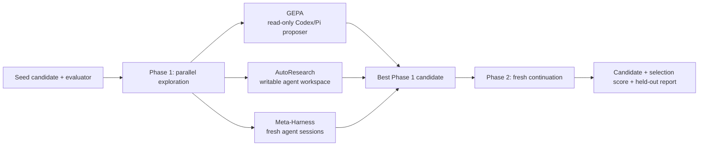

# GEPA Omni

GEPA Omni is an [Agent Plugins 1.0](https://agent-plugins.org/) package and
Codex-compatible plugin for improving any scorable text artifact: prompts,
programs, configurations, schemas, SQL, regular expressions, plans, and agent
instructions.

It uses evaluator-driven search from
[GEPA](https://github.com/gepa-ai/gepa), adds Codex and Pi proposer adapters,
and provides a portfolio workflow across GEPA, AutoResearch, and Meta-Harness.
Each engine is also available on its own for comparison and debugging.

> The GitHub repository is `fleet-gepa-omni`; the installable plugin is
> `gepa-omni`; and the shipped skill is `gepa-omni-skill`. These are separate
> identities by design.

## Install

### Codex

Add the GitHub repository as a Codex marketplace, then install the plugin:

```bash
codex plugin marketplace add Qredence/gepa-omni
codex plugin add gepa-omni@Qredence
```

Start a new Codex task after installation so the skill is loaded. Invoke it by
naming the skill and describing the candidate and evaluator:

```text
Use $gepa-omni-skill to improve this prompt against my evaluator. Preserve the
output format and report the held-out score separately.
```

The skill can also help design a feedback-rich evaluator or compare the GEPA,
AutoResearch, and Meta-Harness engines.

### Portable package

To build a portable runtime payload from a development checkout, stage it into
an empty directory outside the repository:

```bash
stage_parent="$(mktemp -d)"
python3 tools/stage_plugin.py \
  --format portable \
  --output "$stage_parent/gepa-omni"
```

The portable payload contains only `plugin.json`, `skills/`, and `LICENSE`.
For the OpenAI/Codex compatibility payload, use `--format codex`; that payload
contains `.codex-plugin/`, `skills/`, and `LICENSE`.

## How Omni works

The default workflow runs three exploration engines against the same candidate,
objective, evaluator, and selection data. It selects the best Phase 1 result,
then starts a fresh Phase 2 optimizer with that candidate.



The default continuation is fresh GEPA. Set `continuation_engine` explicitly
to continue with AutoResearch or Meta-Harness instead.

Important boundaries:

- `test_set` is withheld from every Phase 1 branch and scored only by the
  final Phase 2 run.
- Omni requires an explicit positive `max_evals` and/or `max_token_cost`. An
  evaluation-only run needs at least four evaluations so all four phases get a
  positive budget slice.
- Omni is orchestration, not a public `engine="omni"` value. Use the default
  workflow or select one of the standalone engines below.
- The public `optimize_anything` launcher accepts a string candidate. The
  local Codex/Pi adapters use named component mappings only at their internal
  proposer boundary.
- `run_dir` and `output_dir` must be outside the checkout when an engine needs
  a workspace or writes diagnostics.

## Evaluator contract

GEPA optimizes the score and feedback returned by your evaluator. Scores are
higher-is-better, and feedback should explain why a candidate failed:

```python
def evaluate(candidate: str, example) -> tuple[float, dict]:
    output = run_system(candidate, example)
    score = grade(output, example)
    return score, {
        "output": output,
        "expected": example.get("gold"),
        "error": example.get("error"),
    }
```

Return failures, diffs, outputs, and partial-credit details in `info`; a bare
float gives the proposer little direction. For stochastic systems, average
multiple samples inside the evaluator and include the sample diagnostics.

The public launcher is string-candidate-first:

```python
from gepa.optimize_anything import OptimizeAnythingConfig, optimize_anything

result = optimize_anything(
    seed_candidate="candidate text",
    evaluator=evaluate,
    dataset=dataset,
    valset=valset,
    test_set=test_set,
    objective="Improve the candidate against the evaluator.",
    config=OptimizeAnythingConfig(
        engine="gepa",
        max_evals=100,
        run_dir="external-runs/example",
        output_dir="external-runs/example/output",
    ),
)
```

Use the data arguments as follows:

| Input | Role |
| --- | --- |
| `dataset` | Examples used for multi-task optimization. |
| `valset` | Representative selection/generalization examples. |
| `test_set` | Sealed, reporting-only examples for the final score. |

The `test_set` score is available in the result metadata. Report it separately
from the selection score so the final number remains an honest held-out
measurement.

See the [API reference](skills/gepa-omni-skill/references/api.md) and
[evaluator guide](skills/gepa-omni-skill/references/writing_evaluators.md) for
the complete launcher contract.

## Engines and backends

| Engine | Search behavior | Local runtime |
| --- | --- | --- |
| `gepa` | Reflects on evaluator feedback, mutates candidates, and keeps a Pareto frontier. | Read-only `CodexAgentProposer`; use Pi explicitly when needed. |
| `autoresearch` | Runs a long-horizon experiment loop with Ralph-style continuation. | Codex by default; Pi and Claude are explicit alternatives. |
| `meta_harness` | Proposes candidates while the framework evaluates and selects them. | Fresh Codex session per iteration by default; Pi and Claude are explicit alternatives. |
| `best_of_n` | Samples independent candidates and keeps the best. | Baseline with no feedback or search history. |

Omit the engine override for Omni. Select `gepa`, `autoresearch`,
`meta_harness`, or `best_of_n` explicitly when comparing one engine, debugging,
or working with a budget too small for four Omni phases.

The Omni helper accepts backend-specific model names:

```python
run_omni(..., agent_backend="codex", codex_model="gpt-5-codex")
run_omni(..., agent_backend="pi", pi_model="provider/model")
```

For Codex, model selection is `codex_model`, then the legacy `agent_model`,
then the authenticated CLI default. For Pi, it is `pi_model`, then
`agent_model`, then the provider default. Claude is available only when
explicitly selected with `agent_backend="claude"` for the agentic engines.

For GEPA P×N proposal sampling, pass
`gepa_parallel_proposals=(parents, mutations)` with a suitable
`max_concurrency`. Omitting it retains the sequential one-worker configuration.

## Requirements and runtime boundaries

- Python 3.10 or newer.
- [`uv`](https://docs.astral.sh/uv/) for repository development.
- An engine-capable `gepa[full]` environment supplied by the consumer. GEPA is
  intentionally not vendored or declared as a root dependency.
- An authenticated CLI for the selected agent backend. Codex is the default.
- When using Codex with `max_token_cost`, both input and output USD-per-million
  token rates.
- For sandboxed Pi runs, `bwrap` on Linux or `sandbox-exec` on macOS. Agent
  engines also require `jq` and `curl`.

The maintained GEPA fork is deployment configuration rather than a dependency
of this repository. Supply its pinned URL and commit in the consuming
environment, for example:

```bash
export GEPA_OMNI_SPEC='gepa[full] @ git+https://<maintained-gepa-fork>/<org>/<repo>.git@<commit>'
uv run --project . --with "$GEPA_OMNI_SPEC" \
  python3 skills/gepa-omni-skill/scripts/preflight.py \
  --engine omni \
  --agent-backend codex \
  --max-token-cost 5 \
  --codex-input-cost-per-million 2 \
  --codex-output-cost-per-million 8
```

Run preflight before a live optimization. It checks imports, engine support,
credentials, agent runners, and sandbox prerequisites; it does not make model
calls unless `--test-lm` is supplied:

```bash
python3 skills/gepa-omni-skill/scripts/preflight.py --engine gepa
python3 skills/gepa-omni-skill/scripts/preflight.py --engine omni
python3 skills/gepa-omni-skill/scripts/preflight.py \
  --engine omni \
  --agent-backend pi
```

The read-only GEPA proposer runs in an external proposal directory. Codex-backed
AutoResearch and Meta-Harness use `--sandbox workspace-write` in their external
agent workspaces. `sandbox=False` is rejected, and Pi has no silent unsandboxed
fallback.

## Repository layout

| Path | Purpose |
| --- | --- |
| `plugin.json` | Portable Agent Plugins 1.0 manifest. |
| `.codex-plugin/plugin.json` | OpenAI/Codex compatibility manifest. |
| `.agents/plugins/marketplace.json` | Codex marketplace metadata. |
| `skills/gepa-omni-skill/SKILL.md` | Shipped skill and default workflow. |
| `skills/gepa-omni-skill/references/` | API, Omni, evaluator, backend, tracking, and gotcha guides. |
| `skills/gepa-omni-skill/scripts/` | Proposers, Omni composition, preflight, runtime guards, and self-evaluation entrypoints. |
| `tests/` and `tools/test_*.py` | Deterministic contract, proposer, pipeline, preflight, staging, and harness tests. |
| `tools/` | Development-only staging and bounded self-evaluation helpers; not shipped. |
| `LICENSE` | MIT license text included in runtime payloads. |

## Development and packaging

Install the development dependencies and run the same checks as CI:

```bash
uv sync --project . --group dev
uv run pytest -q
uv run ruff check .
uv run ruff format --check .
git diff --check
```

Stage the runtime payload when packaging changes:

```bash
portable_stage_parent="$(mktemp -d)"
python3 tools/stage_plugin.py \
  --format portable \
  --output "$portable_stage_parent/gepa-omni"

codex_stage_parent="$(mktemp -d)"
python3 tools/stage_plugin.py \
  --format codex \
  --output "$codex_stage_parent/gepa-omni"
```

Staging copies only tracked runtime files. Keep proposal artifacts, evaluation
runs, credentials, `.plugin-eval/` data, and generated Python caches out of Git.

## Further reading

- [API reference](skills/gepa-omni-skill/references/api.md) — launcher contract,
  modes, budgets, engines, and result metadata.
- [Omni workflow](skills/gepa-omni-skill/references/omni.md) — phase boundaries,
  budget partitioning, model selection, and standalone overrides.
- [Evaluator guide](skills/gepa-omni-skill/references/writing_evaluators.md) —
  feedback-rich evaluators, judges, batching, and stochastic scoring.
- [Codex runtime](skills/gepa-omni-skill/references/codex.md) — proposer
  isolation, diagnostics, and workspace behavior.
- [Pi runtime](skills/gepa-omni-skill/references/pi.md) — explicit Pi backend
  behavior and OS sandbox prerequisites.
- [Gotchas](skills/gepa-omni-skill/references/gotchas.md) — reward hacking,
  selection bias, budgets, stop conditions, and runtime prerequisites.

## License

GEPA Omni is distributed under the [MIT License](LICENSE).
