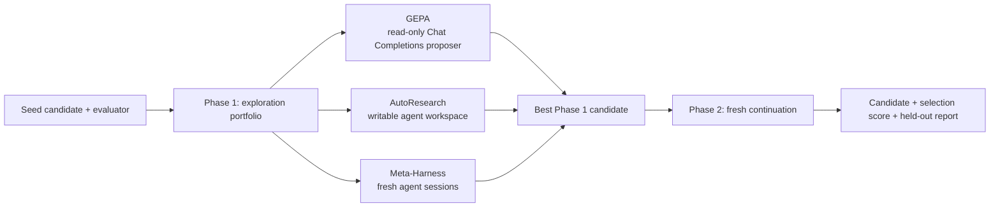

# GEPA Omni

Optimize any scorable text artifact — prompts, programs, configurations,
schemas, SQL, regular expressions, plans, or agent instructions — from plain
evaluator feedback.

GEPA Omni packages the **GEPA Anything** optimization stack as an
[Agent Plugins 1.0](https://agent-plugins.org/) plugin, so any compatible
coding agent can install it as a skill and drive it for you. It ships the
standalone reflective GEPA engine from [PyPI](https://pypi.org/project/gepa/)
plus three plugin-native engines — AutoResearch, Meta-Harness, and Best-of-N —
and runs them together in a two-phase **Omni** workflow.

- **One evaluator in, a better artifact out.** Write a function that scores a
  candidate and explains failures; the engines handle mutation, selection, and
  budgeting.
- **Four engines, one contract.** GEPA, AutoResearch, Meta-Harness, and
  Best-of-N all run against the same candidate, data, and budget.
- **Omni by default.** Phase 1 explores with three engines in parallel; Phase 2
  continues the best candidate with a fresh optimizer.

> **Names:** the repository is `fleet-gepa-omni`, the installable plugin is
> `gepa-omni`, and the shipped skill is `gepa-omni-skill`. These are separate
> identities by design.

## Quick start

### Codex

Add the GitHub repository as a Codex marketplace, then install the plugin:

```bash
codex plugin marketplace add Qredence/gepa-omni
codex plugin add gepa-omni@Qredence
```

Start a new Codex task after installation so the skill loads. Invoke it by
naming the skill and describing the candidate and evaluator:

```text
Use $gepa-omni-skill to improve this prompt against my evaluator. Preserve the
output format and report the held-out score separately.
```

The skill can also help design a feedback-rich evaluator or compare the GEPA,
AutoResearch, and Meta-Harness engines.

## Origin: GEPA Anything

GEPA Omni is a derivative of **GEPA Anything** — the `optimize_anything` API of
the original [gepa-ai/gepa](https://github.com/gepa-ai/gepa) project ("optimize
any text parameter with LLM-based reflection and Pareto-efficient evolutionary
search"). The core idea carries over directly: if you can serialize an artifact
to text and score it, an evaluator plus an LLM proposer can improve it — no
gradients, no RL.

The runtime boundary stays clean:

- The **standalone reflective engine** comes from the published
  [`gepa==0.1.4`](https://pypi.org/project/gepa/0.1.4/) package (installed with
  its `full` extra in development).
- The **plugin-native engines and Omni orchestration** (AutoResearch,
  Meta-Harness, Best-of-N, and the two-phase pipeline) ship inside the skill
  under `skills/gepa-omni-skill/scripts/`. Portions of that native runtime are
  adapted from the MIT-licensed GEPA project at pinned commit
  [`8a2bed96`](https://github.com/gepa-ai/gepa/tree/8a2bed96385202f69caaeb5327a843ed2f5ea225);
  attribution scope is recorded in
  [THIRD_PARTY_NOTICES.md](skills/gepa-omni-skill/THIRD_PARTY_NOTICES.md),
  which ships inside every runtime bundle.

## Packaging: the Agent Plugins format

GEPA Omni is packaged twice from the same tracked content, so it installs into
different agent runtimes without duplication:

- **`plugin.json`** — the portable [Agent Plugins 1.0](https://agent-plugins.org/)
  manifest, validated against the published 1.0 schema. Any runtime that
  implements the Agent Plugins format can mount the plugin from this file.
- **`.codex-plugin/plugin.json`** — the OpenAI/Codex compatibility manifest,
  used by the Codex marketplace flow below.
- **`.agents/plugins/marketplace.json`** — marketplace metadata, which lets the
  GitHub repository itself act as a plugin marketplace.
- **`skills/gepa-omni-skill/`** — the shared payload (instructions, references,
  scripts, and the native runtime) referenced by both manifests.

`tools/stage_plugin.py` builds deployable bundles from a development checkout:
`--format portable` emits `plugin.json` + `skills/` + `LICENSE`, and
`--format codex` emits `.codex-plugin/` + `skills/` + `LICENSE`.

## Install

### Portable bundle

Stage a portable runtime payload into an empty directory outside the
repository:

```bash
stage_parent="$(mktemp -d)"
python3 tools/stage_plugin.py \
  --format portable \
  --output "$stage_parent/gepa-omni"
```

Use `--format codex` for the OpenAI/Codex payload instead.

## How Omni works



Omni is the default workflow: three isolated exploration engines run against
the same candidate, objective, evaluator, and selection data. The best Phase 1
candidate is handed to a fresh Phase 2 continuation — GEPA by default. Set
`continuation_engine` to `autoresearch` or `meta_harness` to continue natively
instead.

Key boundaries:

- `test_set` is withheld from every Phase 1 branch and scored only by the final
  Phase 2 run.
- Omni requires an explicit positive `max_evals` and/or `max_token_cost`. The
  total is split into four balanced slices (three explorations plus one
  continuation), so an evaluation-only run needs at least four evaluations.
- Omni is orchestration, not a public `engine="omni"` value. Omit the engine
  override for the default workflow, or select a standalone engine to compare.
- The public `optimize_anything` launcher accepts a string candidate. The local
  Codex/Pi adapters use named component mappings only at their internal
  proposer boundary.
- Keep `run_dir` and `output_dir` outside the checkout whenever an engine needs
  a workspace or writes diagnostics.

## The evaluator contract

GEPA optimizes whatever your evaluator returns: a higher-is-better score plus
feedback that explains *why* a candidate failed.

```python
def evaluate(candidate: str, example) -> tuple[float, dict]:
    output = run_system(candidate, example)
    score = grade(output, example)
    return score, {
        "output": output,
        "expected": example.get("gold"),
        "error": example.get("error"),
    }
```

Return failures, diffs, outputs, and partial-credit details in `info`; a bare
float gives the proposer little direction. For stochastic systems, average
multiple samples inside the evaluator and include the sample diagnostics.

Launch directly against the pinned PyPI API:

```python
import os
from gepa.optimize_anything import EngineConfig, GEPAConfig, ReflectionConfig, optimize_anything

result = optimize_anything(
    seed_candidate="candidate text",
    evaluator=evaluate,
    dataset=dataset,
    valset=valset,
    objective="Improve the candidate against the evaluator.",
    config=GEPAConfig(
        engine=EngineConfig(max_metric_calls=100, run_dir="external-runs/example"),
        reflection=ReflectionConfig(reflection_lm=os.environ["OPENAI_MODEL"]),
    ),
)
```

Use the data arguments as follows:

| Input | Role |
| --- | --- |
| `dataset` | Examples used for multi-task optimization. |
| `valset` | Representative selection/generalization examples. |
| `test_set` | Sealed, reporting-only examples for the final score. |

The direct PyPI `optimize_anything()` signature has no `test_set` argument and
does not produce held-out-score metadata. The plugin wrapper
`run_optimization(..., engine="gepa")` may accept `task["test_set"]` and score
it after the run; report that wrapper result separately from the selection
score.

See the [API reference](skills/gepa-omni-skill/references/api.md) and
[evaluator guide](skills/gepa-omni-skill/references/writing_evaluators.md) for
the complete launcher contract.

## Engines and backends

| Engine | Search behavior | Local runtime |
| --- | --- | --- |
| `gepa` | Reflects on evaluator feedback, mutates candidates, and keeps a Pareto frontier. | PyPI `gepa==0.1.4` standalone engine with the external Chat Completions proposer. |
| `autoresearch` | Runs a long-horizon experiment loop with Ralph-style continuation. | Plugin-native engine; backend labels select the shared Chat Completions runner. |
| `meta_harness` | Proposes candidates while the framework evaluates and selects them. | Plugin-native engine with fresh agent sessions by default. |
| `best_of_n` | Samples independent candidates and keeps the best. | Plugin-native comparison baseline. |

All engines use the same OpenAI-compatible Chat Completions API. Configure the
endpoint, model, and key once before launching:

```bash
export OPENAI_BASE_URL="https://api.openai.com/v1"
export OPENAI_MODEL="your-model"
export OPENAI_API_KEY="your-api-key"
```

`agent_backend` remains a compatibility label (`codex`, `pi`, or `claude`) kept
in runtime/session metadata. `OPENAI_MODEL` is authoritative, and the three
`OPENAI_*` variables are used for every model call.

When the plugin is invoked through its interactive skill, it asks only for a
missing model or base URL and uses those answers for the current process only.
It does not write them to `.env` or any persistent configuration. The API key
must already be supplied through the environment or a secret manager; the
plugin never asks for an API key in chat. Preflight remains non-interactive and
must run with the final process-scoped values before optimization.

For GEPA P×N proposal sampling, pass
`gepa_parallel_proposals=(parents, mutations)` with a suitable
`max_concurrency`. Omitting it retains the sequential one-worker
configuration.

## Requirements and preflight

- Python 3.10 or newer.
- [`uv`](https://docs.astral.sh/uv/) for repository development.
- The published [`gepa[full]==0.1.4`](https://pypi.org/project/gepa/0.1.4/)
  environment for standalone `gepa` and the reflective integration.
- `OPENAI_BASE_URL`, `OPENAI_MODEL`, and `OPENAI_API_KEY` for an
  OpenAI-compatible Chat Completions endpoint.
- When using `max_token_cost`, both input and output USD-per-million token
  rates.

Preflight checks the shared API configuration and native runtime before a live
run. It never prompts for configuration or performs a model call unless
`--test-lm` is explicitly supplied:

```bash
uv run python skills/gepa-omni-skill/scripts/preflight.py \
  --engine omni \
  --max-token-cost 5 \
  --codex-input-cost-per-million 2 \
  --codex-output-cost-per-million 8
```

The read-only GEPA proposer and native runners use external diagnostics/work
directories. `sandbox=False` is rejected at the wrapper boundary; the Chat
Completions model itself does not execute local tools or shell commands.

## Repository layout

| Path | Purpose |
| --- | --- |
| `plugin.json` | Portable Agent Plugins 1.0 manifest. |
| `.codex-plugin/plugin.json` | OpenAI/Codex compatibility manifest. |
| `.agents/plugins/marketplace.json` | Codex marketplace metadata. |
| `skills/gepa-omni-skill/SKILL.md` | Shipped skill and default workflow. |
| `skills/gepa-omni-skill/references/` | API, Omni, evaluator, backend, tracking, and gotcha guides. |
| `skills/gepa-omni-skill/scripts/` | Proposers, native Omni runtime, preflight, guards, and self-evaluation entrypoints. |
| `skills/gepa-omni-skill/THIRD_PARTY_NOTICES.md` | Pinned MIT provenance for native runtime portions. |
| `tests/` and `tools/test_*.py` | Deterministic contract, proposer, pipeline, preflight, staging, and harness tests. |
| `tools/` | Development-only staging and bounded self-evaluation helpers; not shipped. |
| `LICENSE` | MIT license text included in runtime payloads. |

## Development and packaging

Install the development dependencies and run the same checks as CI:

```bash
uv sync --project . --group dev
uv run pytest -q
uv run ruff check .
uv run ruff format --check .
git diff --check
```

Stage the runtime payloads when packaging changes:

```bash
portable_stage_parent="$(mktemp -d)"
python3 tools/stage_plugin.py \
  --format portable \
  --output "$portable_stage_parent/gepa-omni"

codex_stage_parent="$(mktemp -d)"
python3 tools/stage_plugin.py \
  --format codex \
  --output "$codex_stage_parent/gepa-omni"
```

Staging copies only tracked runtime files. Keep proposal artifacts, evaluation
runs, credentials, `.plugin-eval/` data, and generated Python caches out of
Git. The staged `skills/` tree includes `THIRD_PARTY_NOTICES.md` alongside the
native runtime and the root `LICENSE`.

## Further reading

- [API reference](skills/gepa-omni-skill/references/api.md) — launcher
  contract, modes, budgets, engines, and result metadata.
- [Omni workflow](skills/gepa-omni-skill/references/omni.md) — phase
  boundaries, budget partitioning, model selection, and standalone overrides.
- [Evaluator guide](skills/gepa-omni-skill/references/writing_evaluators.md) —
  feedback-rich evaluators, judges, batching, and stochastic scoring.
- [Codex runtime](skills/gepa-omni-skill/references/codex.md) — proposer
  isolation, diagnostics, and workspace behavior.
- [Pi runtime](skills/gepa-omni-skill/references/pi.md) — explicit Pi backend
  behavior and OS sandbox prerequisites.
- [Gotchas](skills/gepa-omni-skill/references/gotchas.md) — reward hacking,
  selection bias, budgets, stop conditions, and runtime prerequisites.

## Attribution and license

GEPA Omni is distributed under the [MIT License](LICENSE). It builds on the
original **GEPA Anything** project (`optimize_anything`,
[gepa-ai/gepa](https://github.com/gepa-ai/gepa), MIT): the reflective engine is
consumed from the pinned `gepa==0.1.4` PyPI release, and portions of the
shipped native runtime are adapted from the pinned upstream commit
[`8a2bed96`](https://github.com/gepa-ai/gepa/tree/8a2bed96385202f69caaeb5327a843ed2f5ea225).
See [THIRD_PARTY_NOTICES.md](skills/gepa-omni-skill/THIRD_PARTY_NOTICES.md) for
the full attribution and license scope.

Original GEPA repository: **[github.com/gepa-ai/gepa](https://github.com/gepa-ai/gepa)**
